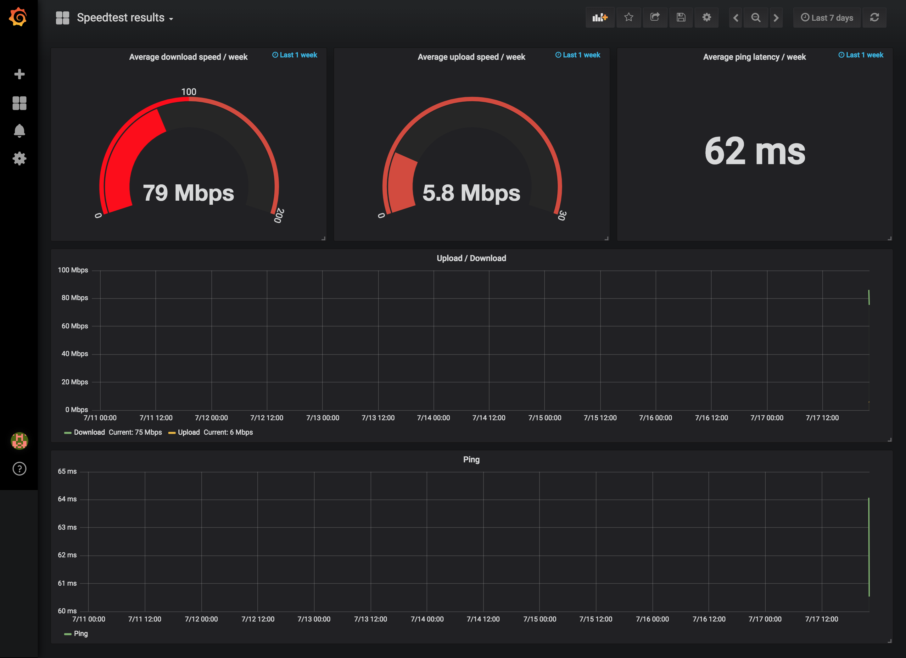

# speedtest-influxdb:0.5.0

- [Introduction](#introduction)
  - [Contributing](#contributing)
  - [Issues](#issues)
- [Getting started](#getting-started)
  - [Installation](#installation)
  - [Quickstart](#quickstart)
  - [Environment Variables](#environment-variables)
  - [Grafana](#grafana)

# Introduction
Git-Repository to build [Docker](https://www.docker.com/) Container Image to run speedtest with [speedtest.net](http://www.speedtest.net/) to influxdb. The Implementation is inspired by https://github.com/frdmn/docker-speedtest

## Contributing
If you find this image helpfull, so you can see here how you can help:
- Create an new branch and send a pull request with your features and bug fixes
- Help users resolve their [issues](https://github.com/QuadStingray/docker-speedtest-influxdb/issues).

## Issues
Before reporting your issue please try updating Docker to the latest version and check if it resolves the issue. Refer to the Docker [installation guide](https://docs.docker.com/installation) for instructions.

If that recommendations do not help then [report your issue](https://github.com/QuadStingray/docker-speedtest-influxdb/issues/new) along with the following information:

- Output of the `docker version` and `docker info` commands
- The `docker run` command or `docker-compose.yml` used to start the
  image. Mask out the sensitive bits.

# Getting started
## Installation
Automated builds of the image are available on
[Dockerhub](https://hub.docker.com/r/quadstingray/docker-speedtest/)

```bash
docker pull speedtest-influxdb:0.5.0
```

Alternatively you can build the image yourself.
```bash
docker build . --tag 'speedtest-influxdb:dev';
```

## Quickstart
```bash
docker run -e "HOST=local" speedtest-influxdb:0.5.0 
```

*Alternatively, you can use the sample [docker-compose.yml](docker-compose.yml) file to start the container using [Docker Compose](https://docs.docker.com/compose/)*


## Environment Variables

| Variable         | Default Value          | Informations                                                                                  |
|:-----------------|:-----------------------|:----------------------------------------------------------------------------------------------|
| INTERVAL         | 3600                   | Seconds between import of statistics                                                          |
| HOST             | local                  | host where the speedtest is running for grafana filter                                        |
| SPEEDTEST_SERVER | ''                     | speedtest.net server. Empty string, means speedtest return server for test                    |
| INFLUXDB_URL     | http://influxdb:8086   | Url of your InfluxDb installation                                                             |
| INFLUXDB_DB      | speedtest              | Database at your InfluxDb installation                                                        |
| INFLUXDB_USER    | DEFAULT                | optional user for insert to your InfluxDb                                                     |
| INFLUXDB_PWD     | DEFAULT                | optional password for insert to your InfluxDb                                                 |

## Grafana
There is an sample grafana dashboard at this repository. You can import that to your Grafana installation. [speedtest.json](docker/grafana/provisioning/dashboards/speedtest.json)



